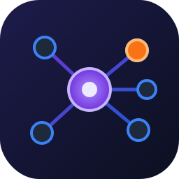

<div align="center">



# Nerveplane

**The coordination plane for autonomous coding agents** — local-first, MCP-native, repo- and service-aware.

[](https://github.com/sumanyumuku98/Nerveplane/actions/workflows/ci.yml)
[](https://www.npmjs.com/package/nerveplane)
[](https://sumanyumuku98.github.io/Nerveplane/)
[](LICENSE)
[](https://bun.sh)
[](https://modelcontextprotocol.io)
[](https://github.com/sumanyumuku98/Nerveplane/pulls)

[Documentation](https://sumanyumuku98.github.io/Nerveplane/) · [Getting Started](https://sumanyumuku98.github.io/Nerveplane/guide/getting-started) · [Concepts](https://sumanyumuku98.github.io/Nerveplane/guide/concepts) · [Roadmap](https://sumanyumuku98.github.io/Nerveplane/roadmap)

</div>

---

> **As developers run multiple coding agents in parallel, the bottleneck shifts from code generation to *coordination*.** Nerveplane is the missing coordination layer.

## The problem

Git worktrees stop two agents from overwriting the same file — but they don't stop **logical drift**:

- A backend agent changes an API response while a frontend agent builds against the old shape.
- A service agent changes an event schema while a subscriber in another repo goes stale.
- Two agents implement the same thing twice, or one deletes what the other depends on.

None of these are git conflicts, so nothing catches them until merge — and [nearly **1 in 3 AI-generated PRs already hit merge conflicts**](https://arxiv.org/abs/2604.03551) at the file level alone. Nerveplane catches the rest, **before merge**, by grounding agent coordination in real repository and service-dependency state.

## What it does

| | |
|---|---|
| 👁️ **Passive sensing** | The daemon watches registered worktrees itself — changed files, diffs, contract changes — and emits coordination events **without agents having to report anything**. |
| ⚔️ **Conflict detection** | Same-file (high) and same-package (medium) collisions between agents, routed to exactly the pair involved, with a conservative, dismissible noise budget. |
| 🔗 **Contract-aware cross-repo routing** | Change an OpenAPI / GraphQL / AsyncAPI / protobuf contract and consumer-repo agents (direct, transitive, and test owners) get warned about the breaking change — across repo boundaries. |
| 📒 **Decision ledger** | Durable project decisions live separately from chat and are queryable by file, repo, service, or task. |
| 💬 **Direct agent-to-agent chat** | A first-class `chat` tool: threaded DMs between agents with **real-time delivery** — an agent can `wait` (block) for a reply, and incoming messages are injected before a teammate's next edit. |
| 🔌 **MCP-native** | Seven consolidated MCP tools over stdio **and** Streamable HTTP, plus a Claude Code PreToolUse hook that injects warnings *before* an agent edits. |
| 📊 **Live dashboard** | A Svelte dashboard (`/dashboard`) with SSE-driven agents, conflicts, timeline, chat, decisions, and human actions. |
| 💻 **Local-first** | One user-level daemon, SQLite (WAL), no cloud dependency. Single binary, or `npm`. |

## Install

The binary installs bundle the runtime — **no Bun required**.

```bash
# Homebrew (macOS / Linux)
brew install sumanyumuku98/nerveplane/nerveplane

# Shell (macOS / Linux, arm64 & x64)
curl -fsSL https://raw.githubusercontent.com/sumanyumuku98/Nerveplane/main/install.sh | sh

# Windows (PowerShell)
irm https://raw.githubusercontent.com/sumanyumuku98/Nerveplane/main/install.ps1 | iex

# npm (any OS; requires Bun ≥ 1.2)
npm i -g nerveplane
```

## Quickstart with Claude Code

**Once per machine** — global setup (hooks, login service, MCP):

```bash
nerveplane setup                                          # global hooks + login service + register this repo
claude mcp add --scope user nerveplane -- nerveplane mcp  # register the MCP server for all projects
# restart Claude Code
```

That's it — **no per-repo setup**. The hooks are installed at user scope (`~/.claude`), the daemon runs as a login service, and **every agent you launch auto-registers** (via a SessionStart hook). Run your agents (one per worktree) and Nerveplane senses, routes, and warns automatically.

<details><summary>Prefer per-repo or manual setup?</summary>

```bash
nerveplane daemon                            # or: nerveplane service install (keep it running at login)
nerveplane init                              # (optional) pre-register this repo
claude mcp add nerveplane -- nerveplane mcp  # register the MCP server (native Claude Code CLI)
nerveplane install claude-code               # project-scoped hooks (no `claude` CLI? add --with-mcp)
```
</details>

`claude mcp add` wires up the [seven MCP tools](https://sumanyumuku98.github.io/Nerveplane/reference/mcp-tools); the hooks auto-register each agent and inject warnings/DMs before edits. Agents call `register` (to add capabilities/task) → `sync` → `publish`, and the daemon passively senses everything else — so agents are warned about each other's edits even if they never publish.

## See it work

Self-contained demos (isolated daemon + temp repos, auto-cleaned):

```bash
sh examples/demo-passive-sensing.sh    # agent B sees agent A's edit — no publish needed
sh examples/demo-contract-routing.sh   # cross-repo breaking-change routing
sh examples/hook-check.sh              # the hook injects a warning before an edit
```

## CLI

| Command | Description |
|---|---|
| `nerveplane setup` | One-time machine setup: global hooks + login service + register this repo (`--no-service`, `--print`) |
| `nerveplane daemon` | Run the coordination daemon (`127.0.0.1:7734`) |
| `nerveplane install claude-code` | Install the Claude Code hooks + agent instructions (`--global`, `--with-mcp`, `--print`) |
| `nerveplane init` | (Optional) register the current repo — agents auto-register too |
| `nerveplane service install` | Keep the daemon running at login (launchd / systemd) |
| `nerveplane agents` · `events` · `conflicts` | Inspect state |
| `nerveplane service scan [path]` · `services` | Load / list the service graph |
| `nerveplane dashboard` | Open the live web UI |
| `nerveplane eval` | Run the deterministic conflict-detection eval |

## How it works

```
CLI / Claude Code / Cursor / Codex   (MCP stdio + HTTP · REST · SSE · A2A later)
        │
        ▼
  Nerveplane daemon (127.0.0.1:7734, ~/.nerveplane/)
   ├─ Integration  MCP tools · Hono REST · SSE · Claude Code hook
   ├─ Core         Agent Registry · Presence(TTL) · Tasks · Event Log · Decisions
   ├─ Sensing      repo watcher (git poll) · diff analyzer   ← passive, no agent compliance
   ├─ Service      service graph (YAML) · OpenAPI/GraphQL/AsyncAPI/protobuf diff
   ├─ Routing      recipient selection · severity · dedup/suppression · conflict detection
   └─ Storage      SQLite (WAL) via Drizzle → optional Postgres later
```

Everything an agent sees flows through one write path (`emitEvent` → routing → per-recipient deliveries → SSE), whether it came from an agent's `publish` or the passive sensing loop. See the [Concepts](https://sumanyumuku98.github.io/Nerveplane/guide/concepts) and [full spec](docs/nerveplane_spec.md).

## Run from source

Requires [Bun](https://bun.sh) ≥ 1.2.

```bash
git clone https://github.com/sumanyumuku98/Nerveplane.git && cd Nerveplane
bun install && bun run build:dashboard
bun run daemon                       # then use `bun run src/index.ts <command>`
```

## Development

```bash
bun test            # unit + integration tests
bun run typecheck   # tsc --noEmit (strict)
bun run build       # single-binary via bun build --compile
bun run docs:dev    # docs site (VitePress)
```

CI (typecheck · tests · conflict-detection eval gate · dashboard + binary build) runs on every push and PR.

## Status

**v0.6.0 — published.** Passive sensing, intra- and cross-repo conflict/contract detection (4 formats), decision ledger, direct real-time agent-to-agent chat, dashboard, MCP (stdio + HTTP, 7 tools), one-command global setup with zero-touch agent registration, and full distribution (npm + binaries + Homebrew). Future work (deeper semantic intelligence, the cross-org A2A protocol + signed identities, team/distributed mode) is tracked in the [roadmap](https://sumanyumuku98.github.io/Nerveplane/roadmap).

## Contributing

PRs welcome — one focused PR per change, with `bun test && bun run typecheck` green. See the [roadmap](https://sumanyumuku98.github.io/Nerveplane/roadmap) for where to start.

## License

[FSL-1.1-MIT](LICENSE) © 2026 Sumanyu Muku — the [Functional Source License](https://fsl.software): source-available, free to use and self-host, no competing/commercial resale; **converts to MIT two years after each release**. (Versions ≤ 0.3.0 were published under MIT and stay MIT.)

Contributions are accepted under the [DCO](CONTRIBUTING.md).
