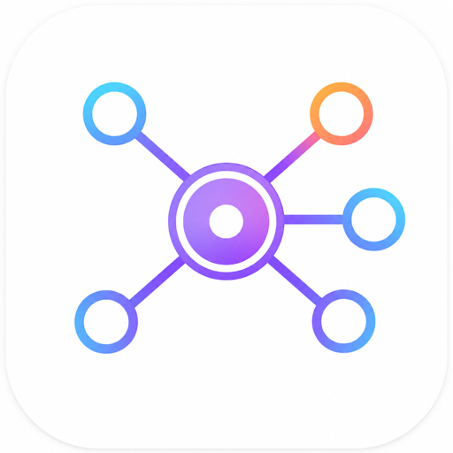

<div align="center">



# Nerveplane

**The coordination plane for autonomous coding agents** — local-first, MCP-native, repo- and service-aware.

Works with **Claude Code, OpenAI Codex, opencode — any MCP-capable CLI**.

[](https://github.com/sumanyumuku98/Nerveplane/actions/workflows/ci.yml)
[](https://www.npmjs.com/package/nerveplane)
[](https://sumanyumuku98.github.io/Nerveplane/)
[](LICENSE)
[](https://bun.sh)
[](https://modelcontextprotocol.io)
[](https://github.com/sumanyumuku98/Nerveplane/pulls)

[Documentation](https://sumanyumuku98.github.io/Nerveplane/) · [Getting Started](https://sumanyumuku98.github.io/Nerveplane/guide/getting-started) · [Concepts](https://sumanyumuku98.github.io/Nerveplane/guide/concepts) · [Roadmap](https://sumanyumuku98.github.io/Nerveplane/roadmap)

</div>

---

> **As developers run multiple coding agents in parallel, the bottleneck shifts from code generation to *coordination*.** Nerveplane is the missing coordination layer.

## The problem

Git worktrees stop two agents from overwriting the same file — but they don't stop **logical drift**:

- A backend agent changes an API response while a frontend agent builds against the old shape.
- A service agent changes an event schema while a subscriber in another repo goes stale.
- Two agents implement the same thing twice, or one deletes what the other depends on.

None of these are git conflicts, so nothing catches them until merge — and [nearly **1 in 3 AI-generated PRs already hit merge conflicts**](https://arxiv.org/abs/2604.03551) at the file level alone. Nerveplane catches the rest, **before merge**, by grounding agent coordination in real repository and service-dependency state.

## What it does

| | |
|---|---|
| 👁️ **Passive sensing** | The daemon watches registered worktrees itself — changed files, diffs, contract changes — and emits coordination events **without agents having to report anything**. |
| ⚔️ **Conflict detection** | Same-file (high) and same-package (medium) collisions between agents, routed to exactly the pair involved, with a conservative, dismissible noise budget. |
| 🔗 **Contract-aware cross-repo routing** | Change an OpenAPI / GraphQL / AsyncAPI / protobuf contract and consumer-repo agents (direct, transitive, and test owners) get warned about the breaking change — across repo boundaries. |
| 📒 **Decision ledger** | Durable project decisions live separately from chat and are queryable by file, repo, service, or task. |
| 🧠 **Universal memory** | A shared, durable memory across agents **and CLIs**: `remember` gotchas/decisions/progress, `recall` them (auto-injected at session start + into worker turns). One agent's context resumes on another — even a different CLI. Three modes via `nerveplane memory setup`: **keyword** (FTS5, local, default), **semantic** (mem0 sidecar), **hybrid** (fused). |
| 💬 **Direct agent-to-agent chat** | A first-class `chat` tool: threaded DMs between agents with **real-time delivery** — an agent can `wait` (block) for a reply, and incoming messages are injected before a teammate's next edit. |
| 🤖 **Auto-enrolled worker pool** | Open any agent in a repo and it's **auto-enrolled** — the daemon then keeps a supervised headless worker alive for that repo, across restarts, so you never launch one per repo. Each worker blocks on its inbox and wakes a headless turn to reply to teammates with **no human in the loop**; idle workers long-poll at **~zero token cost**. Full control via `nerveplane workers` · `worker disable` · `worker auto off`, or run one by hand with `nerveplane worker --agent <claude\|codex\|opencode>`. |
| 📝 **Autonomous memory checkpoints** | Finish a turn having recorded a decision, handed off a task, or made substantial changes without saving anything, and a Stop-hook reminds the agent to `remember` — so durable context isn't lost between sessions or CLIs. |
| 🔌 **MCP-native, agent-agnostic** | Eight consolidated MCP tools over stdio **and** Streamable HTTP — usable by **any MCP-capable CLI** (Claude Code, OpenAI Codex, opencode, …). On Claude Code you also get PreToolUse/SessionStart/Stop hooks that inject warnings, auto-register agents, and handle DMs before idling. |
| 📊 **Live dashboard** | A Svelte dashboard (`/dashboard`) with SSE-driven agents, conflicts, timeline, chat, decisions, and human actions. |
| 🖥️ **Terminal UI** | `nerveplane watch` — a full-screen SSE-driven monitor (agents, conflicts, events, chat) in the terminal; plus interactive pickers for `worker`/`install`/`conflicts`. Zero-dep ANSI, ships in the single binary. |
| 💻 **Local-first** | One user-level daemon, SQLite (WAL), no cloud dependency by default. Installed via `npm`. |

## Install

```bash
npm i -g nerveplane      # requires Bun ≥ 1.2 (the runtime) and Node (for optional semantic memory)
```

> Nerveplane ships via **npm**. The CLI runs on Bun; Node is used only by the optional mem0 semantic-memory sidecar ([Memory guide](https://sumanyumuku98.github.io/Nerveplane/guide/memory)). Since `npm` already brings Node, everything you need is present.

## Quickstart

`nerveplane install <agent>` registers the [eight MCP tools](https://sumanyumuku98.github.io/Nerveplane/reference/mcp-tools) with your CLI and drops in the coordination instructions. Pick your agent:

```bash
# Claude Code — global, once per machine (also installs the zero-touch hooks)
nerveplane setup && claude mcp add --scope user nerveplane -- nerveplane mcp

# OpenAI Codex — MCP server in ~/.codex/config.toml + AGENTS.md
nerveplane install codex

# opencode — MCP server in opencode.json + AGENTS.md
nerveplane install opencode

# verify any of them
nerveplane doctor                       # which agents are installed + MCP-registered
```

From there, agents call `register` → `sync` → `publish` → `chat`, and the daemon passively senses everything else. On **Claude Code** you also get zero-touch hooks (auto-register, pre-edit warning injection, autonomous stop-reply); other CLIs coordinate through the MCP tools + an `AGENTS.md` protocol. See the [CLI Agents guide](https://sumanyumuku98.github.io/Nerveplane/guide/agents) for the full support matrix.

**Works with your agents:**

| | MCP tools | `worker` (headless) | Zero-touch hooks |
|---|:---:|:---:|:---:|
| Claude Code | ✅ | ✅ | ✅ |
| OpenAI Codex | ✅ | ✅ | — |
| opencode | ✅ | ✅ | — |
| any MCP client | ✅ | — | — |

## See it work

Self-contained demos (isolated daemon + temp repos, auto-cleaned):

```bash
sh examples/demo-passive-sensing.sh    # agent B sees agent A's edit — no publish needed
sh examples/demo-contract-routing.sh   # cross-repo breaking-change routing
sh examples/hook-check.sh              # the hook injects a warning before an edit
```

## CLI

| Command | Description |
|---|---|
| `nerveplane setup` | One-time machine setup: global hooks + login service + register this repo (`--no-service`, `--print`) |
| `nerveplane daemon` | Run the coordination daemon (`127.0.0.1:7734`) |
| `nerveplane install claude-code` | Install the Claude Code hooks + agent instructions (`--global`, `--with-mcp`, `--print`) |
| `nerveplane init` | (Optional) register the current repo — agents auto-register too |
| `nerveplane workers` · `worker enable\|disable` · `worker auto on\|off` | List / control the daemon-supervised **auto-enrolled worker pool** (enrollment is automatic) |
| `nerveplane worker [--agent <id>]` | Run a headless autonomous worker for this repo by hand |
| `nerveplane service install` | Keep the daemon running at login (launchd / systemd) |
| `nerveplane agents` · `events` · `conflicts` | Inspect state |
| `nerveplane service scan [path]` · `services` | Load / list the service graph |
| `nerveplane dashboard` | Open the live web UI |
| `nerveplane eval` | Run the deterministic conflict-detection eval |

## How it works

```
CLI / Claude Code / Cursor / Codex   (MCP stdio + HTTP · REST · SSE · A2A later)
        │
        ▼
  Nerveplane daemon (127.0.0.1:7734, ~/.nerveplane/)
   ├─ Integration  MCP tools · Hono REST · SSE · Claude Code hook
   ├─ Core         Agent Registry · Presence(TTL) · Tasks · Event Log · Decisions
   ├─ Sensing      repo watcher (git poll) · diff analyzer   ← passive, no agent compliance
   ├─ Service      service graph (YAML) · OpenAPI/GraphQL/AsyncAPI/protobuf diff
   ├─ Routing      recipient selection · severity · dedup/suppression · conflict detection
   └─ Storage      SQLite (WAL) via Drizzle → optional Postgres later
```

Everything an agent sees flows through one write path (`emitEvent` → routing → per-recipient deliveries → SSE), whether it came from an agent's `publish` or the passive sensing loop. See the [Concepts](https://sumanyumuku98.github.io/Nerveplane/guide/concepts) and [full spec](docs/nerveplane_spec.md).

## Run from source

Requires [Bun](https://bun.sh) ≥ 1.2.

```bash
git clone https://github.com/sumanyumuku98/Nerveplane.git && cd Nerveplane
bun install && bun run build:dashboard
bun run daemon                       # then use `bun run src/index.ts <command>`
```

## Development

```bash
bun test            # unit + integration tests
bun run typecheck   # tsc --noEmit (strict)
bun run build       # single-binary via bun build --compile
bun run docs:dev    # docs site (VitePress)
```

CI (typecheck · tests · conflict-detection eval gate · dashboard + binary build) runs on every push and PR.

## Status

**v0.17.0 — published.** **Auto-enrolled worker pool** — open any agent in a repo and the daemon keeps a supervised headless worker alive for it across restarts, so coordination never goes dark and you never launch a worker per repo; idle workers long-poll at ~zero token cost, with `nerveplane workers` / `worker disable` / `worker auto off` for control, and worker turns connect over **warm HTTP MCP** (no per-turn stdio bridge). **Autonomous memory checkpoints** — a Stop-hook reminds an agent that recorded a decision, handed off a task, or made substantial changes to `remember` before going idle, so durable context isn't lost. Built on: **semantic + hybrid memory** — the shared `memory` layer recalls by meaning (`keyword` FTS5 default, `semantic` via a local mem0 sidecar, or `hybrid`, chosen with `nerveplane memory setup`; records stay in your SQLite, recall falls back to keyword if the sidecar is unavailable); **universal cross-CLI memory** (`remember`/`recall`, auto-injected at session start + into worker turns) so a task resumes on a different agent or CLI; a **Terminal UI** (`nerveplane watch` + interactive `worker`/`install`/`conflicts` pickers); **CLI-agent-agnostic** support for Claude Code, OpenAI Codex, and opencode (any MCP-capable CLI, both non-Claude providers validated live); passive sensing; intra- and cross-repo conflict/contract detection (4 formats); a decision ledger; real-time agent-to-agent chat with autonomous Stop-hook replies; owner-verified directives + sensitive-content scanning; a dashboard; MCP (stdio + HTTP, 8 tools); one-command global setup with zero-touch registration; process-based agent liveness; a supervised login service (launchd/systemd); and **npm** distribution. Future work (automatic memory extraction, the cross-org A2A protocol + full signed identities, team/distributed mode) is tracked in the [roadmap](https://sumanyumuku98.github.io/Nerveplane/roadmap).

## Contributing

PRs welcome — one focused PR per change, with `bun test && bun run typecheck` green. See the [roadmap](https://sumanyumuku98.github.io/Nerveplane/roadmap) for where to start.

## License

[FSL-1.1-MIT](LICENSE) © 2026 Sumanyu Muku — the [Functional Source License](https://fsl.software): source-available, free to use and self-host, no competing/commercial resale; **converts to MIT two years after each release**. (Versions ≤ 0.3.0 were published under MIT and stay MIT.)

Contributions are accepted under the [DCO](CONTRIBUTING.md).
